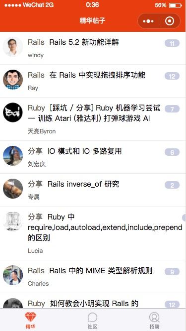
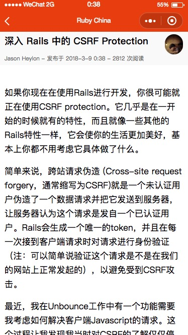

# ruby-china-wechat-app
[RubyChina](https://ruby-china.org/) WeChat app, based on [WEPY](https://github.com/Tencent/wepy).

## preview



## install and run the project

1. install wepy

```bash
npm install wepy-cli -g
```

2. clone repo

```bash
git clone git@github.com:JasonHeylon/ruby-china-wechat-app.git
```

3. install dependences

```bash
cd ruby-china-wechat-app
npm install
```

4. run the project

```bash
wepy build --watch
```
